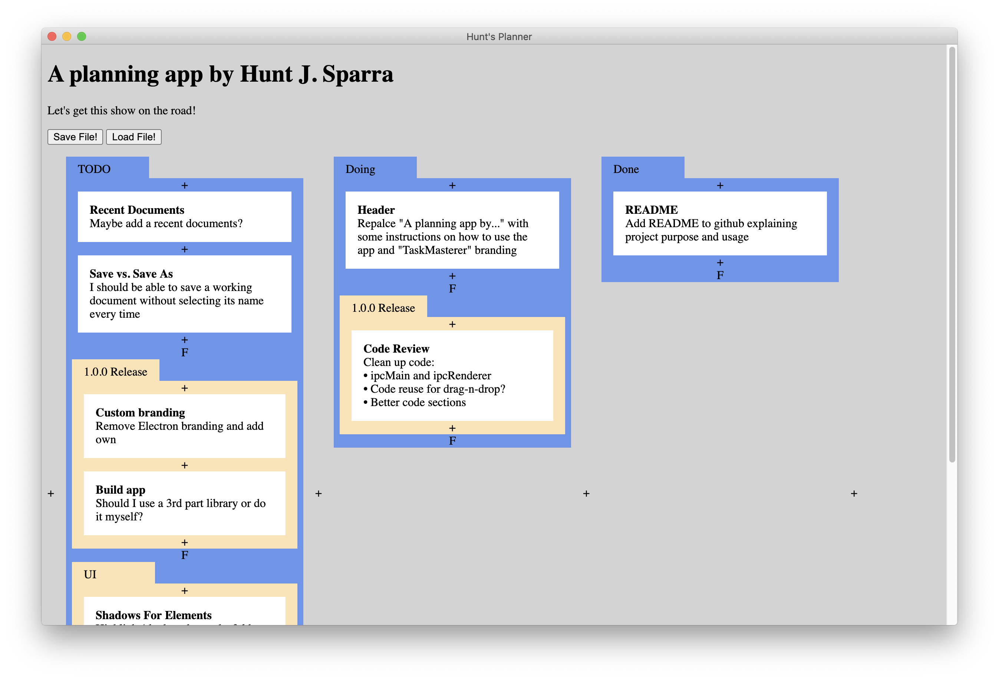

# TaskMasterer
A task management application where tasks can be organized into columns and folders.

Cards, column, and folders can dragged and dropped; text can be double clicked to be editable; and a clicked card, column, or folder can be deleted with backspace.

## Statement of Purpose
I needed a simple, but effective, way to organize my tasks. All the applicaitons I knew of either were more compelx than I wanted or lacked more than 1 layer of organization. So... I made what I wanted instead of looking up more apps.

## Why Electron?
A few reasons:
1. I use a Mac as my work computer, but I might not be on one forever, which means I need an app that works on multiple platforms.
2. The storage and rendering of tasks is very structured and mostly static, which meant HTML and CSS would work well without too much JavaScript.
3. I did not want to spend too much developing the app (I just want to organize tasks for my other projects, not have another new project).
4. I want to work offline.

Electron checks all these boxes. Plus, I get a chance to improve my HTML, CSS, and JS!

## Why does it look ugly?
I wanted to get a functiona; version done first. The next big thing on my list of to overhaul the UI to look how I originally planned it to (some shadows, add a few icons, use a less garish color for highlighting).

